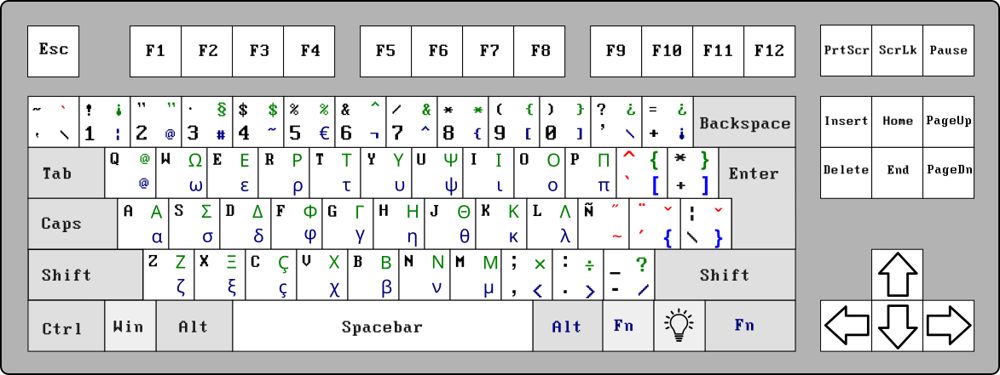

# myXmodmap

Xmodmap with Spanish required keys on an English Keyboard. It could be used for French too.

### Xmodmap

Right Alt works as Alt+Gr, adding additional positions.

Key at the position on the right of "L" is "Ñ" for this layout, but it is also as AltGr+N, as "Ç" is AltGr+C.

Because the "Ñ" key falls on the ":;" key, the comma and the period were changed. Shift+comma is ";" and shift+period is ":".

AltGr+Z and AltGr+comma are "<". AltGr+X and AltGr+period are ">".

At the left of 1, the key "~`", with AltGr is "\" and AltGr+Shift is dead grave tilde (you press it and later "e", and it makes "è").

Also, AltGr+"\[" is the same dead grave tilde, and  with "\]", it produces the circumflex tilde.

The 2 has the quotation marks using Shift, and "@" using AltGr. Also, AltGr+Q produces the at-sign.

### Xmodmap with Greek Characters 

I hope it could be useful to write Spanish and perhaps some math with an English Keyboard.

I am using this layout right now.

### Enjoy

Have a nice one!

                                                       - oOo -
